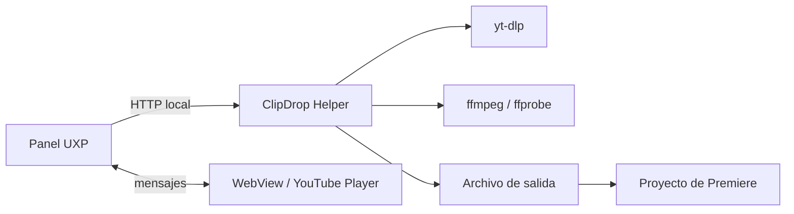

# Arquitectura

ClipDrop separa la interfaz integrada con Premiere de las operaciones
multimedia que UXP no puede ejecutar directamente.

## Panel UXP

`plugin/` contiene la interfaz, selección In/Out, comunicación con el
reproductor y uso de la API de Premiere. El panel sólo solicita acceso a la
carpeta elegida y a dominios declarados en `manifest.json`.

## Preview

`plugin/preview/` carga la API oficial de YouTube dentro de una WebView local.
El reproductor conserva controles, branding y restricciones de YouTube.

El panel y la WebView intercambian mensajes versionados. El panel mantiene la
selección canónica en segundos; el preview no determina la precisión final del
recorte.

## Helper

`helper/` expone una API HTTP en `127.0.0.1:47821`. Valida solicitudes, crea
trabajos, ejecuta yt-dlp y ffmpeg y reporta progreso. Las rutas de trabajos
requieren el encabezado `x-clipdrop-client`.

## Conversión

- Video con audio: MP4 H.264/AAC.
- Audio: WAV a 48 kHz.
- Video sin audio: MP4 H.264.

ffmpeg aplica el In y Out numérico para que el archivo final no dependa del
keyframe usado por el preview al navegar.

## Importación

El panel crea o reutiliza `ClipDrop Imports`. La creación usa
`project.lockedAccess()` y una transacción; el archivo se importa mediante
`Project.importFiles()`.

## Distribución futura

La versión independiente empaquetará el Helper y herramientas multimedia,
registrará un servicio por usuario y usará UPIA para instalar el panel. El
diseño completo está en
`docs/superpowers/specs/2026-07-23-clipdrop-standalone-distribution-design.md`.
