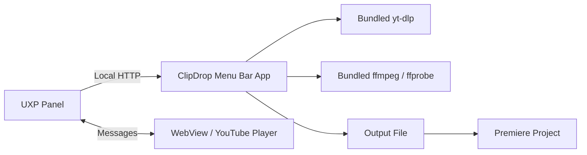

# Architecture

ClipDrop separates Premiere's UXP interface from multimedia operations that UXP
cannot execute directly.

## Menu Bar App

`companion/` is an Electron app with no normal window. It owns the local engine,
starts at login, exposes status and recovery actions in the macOS menu bar, and
bundles every executable dependency. The user never starts a separate process
manually.

On first launch for each version, the app registers the bundled Premiere panel
through Adobe's UPIA executable.

## UXP Panel

`plugin/` contains the interface, In/Out selection, player communication, and
Premiere API integration. The panel requests access only to the selected folder
and the domains declared in `manifest.json`.

The custom controls avoid native UXP button styling differences while retaining
keyboard activation, focus, pressed state, and disabled state.

## Preview

`plugin/preview/` loads the official YouTube API inside a local WebView. The
player retains YouTube controls, branding, and restrictions. The panel owns the
canonical selection in seconds.

## Local Engine

`helper/` contains the reusable engine modules. The companion app loads them
inside its own process and exposes an HTTP API only at `127.0.0.1:47821`. Job
routes require the `x-clipdrop-client` header.

## Conversion

- Video with audio: H.264/AAC MP4.
- Audio only: 48 kHz WAV.
- Video only: H.264 MP4.

ffmpeg applies the numeric In and Out values so the final cut does not depend on
the preview's seek keyframe.

## Import

The panel creates or reuses `ClipDrop Imports`. Creation uses
`project.lockedAccess()` and a transaction, while `Project.importFiles()`
imports the completed file.
