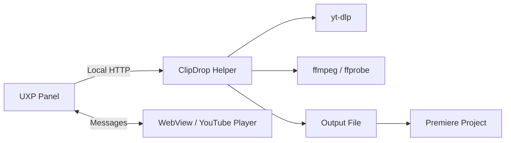

# Architecture

ClipDrop separates the Premiere-integrated interface from multimedia operations
that UXP cannot execute directly.

## UXP Panel

`plugin/` contains the interface, In/Out selection, player communication, and
Premiere API integration. The panel requests access only to the selected folder
and the domains declared in `manifest.json`.

## Preview

`plugin/preview/` loads the official YouTube API inside a local WebView. The
player retains YouTube controls, branding, and restrictions.

The panel and WebView exchange versioned messages. The panel owns the canonical
selection in seconds; the preview does not determine final trimming precision.

## Helper

`helper/` exposes an HTTP API at `127.0.0.1:47821`. It validates requests,
creates jobs, runs yt-dlp and ffmpeg, and reports progress. Job routes require
the `x-clipdrop-client` header.

## Conversion

- Video with audio: H.264/AAC MP4.
- Audio: 48 kHz WAV.
- Video without audio: H.264 MP4.

ffmpeg applies the numeric In and Out values so the final file does not depend
on the preview's seek keyframe.

## Import

The panel creates or reuses `ClipDrop Imports`. Creation uses
`project.lockedAccess()` and a transaction, while `Project.importFiles()`
imports the output file.

## Future Distribution

The standalone release will bundle the Helper and multimedia tools, register a
per-user service, and use UPIA to install the panel. See
`docs/superpowers/specs/2026-07-23-clipdrop-standalone-distribution-design.md`.
