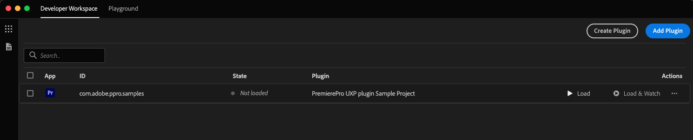
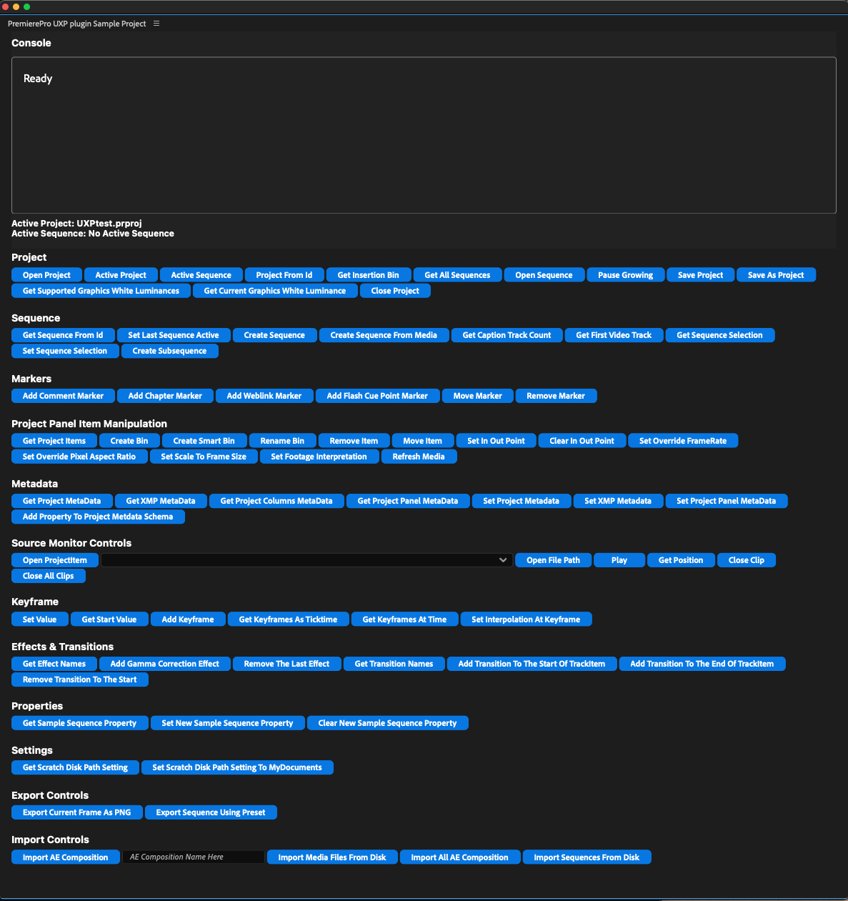

# Premiere Pro UXP Samples

A collection of sample plugins for Adobe Premiere Pro built with UXP. Use them as a reference, adapt them in your own projects, or explore them to understand the Premiere Pro UXP API surface. The full API reference is available at [developer.adobe.com/premiere-pro/uxp](https://developer.adobe.com/premiere-pro/uxp/).

**New to UXP plugins?** We recommend starting with the official [**Building your first UXP plugin**](https://developer.adobe.com/premiere-pro/uxp/plugins/) tutorial. It walks through scaffolding a plugin with the UXP Developer Tool and loading it into Premiere Pro. The samples in this repository will be easier to follow afterwards.

---

## Contents

- [Prerequisites](#prerequisites)
- [Samples](#samples)
- [Version compatibility](#version-compatibility)
- [Getting started](#getting-started)
- [TypeScript support](#typescript-support)
- [Linting](#linting)
- [Frequently asked questions](#frequently-asked-questions)
- [Additional resources](#additional-resources)
- [Contributing](#contributing)
- [License](#license)

---

## Prerequisites

| Tool                                | Version            | Where to get it                                                                                          |
| :---------------------------------- | :----------------: | :------------------------------------------------------------------------------------------------------- |
| **Premiere Pro** (stable or beta)   | `25.2` or newer    | [adobe.com/products/premiere](https://www.adobe.com/products/premiere.html)                              |
| **UXP Developer Tool** (UDT)        | `2.2` or newer     | Install via [Creative Cloud Desktop](https://creativecloud.adobe.com/apps/download/uxp-developer-tools)  |
| **Node.js**                         | LTS (`18.x` or newer) | [nodejs.org](https://nodejs.org/)                                                                     |
| **Code editor**                     | —                  | Visual Studio Code, Cursor, or any editor of your choice                                                 |

Before loading any plugin from UDT, enable **Developer Mode** in Premiere Pro:

> **Settings → Plugins → Enable developer mode**, then restart Premiere Pro.

---

## Samples

| Sample | Description | Stack | Build required |
| :--- | :--- | :--- | :--- |
| [`premiere-api`](./sample-panels/premiere-api/) | A comprehensive reference panel that exercises a broad set of Premiere UXP APIs: projects, sequences, markers, metadata, effects, transitions, keyframes, source monitor, import/export, encoder, transcripts, and project conversion (AAF, FCPXML, OTIO). The recommended starting point when investigating how a specific API behaves. | TypeScript | Yes |
| [`metadata-handler`](./sample-panels/metadata-handler/) | A production-style workflow panel for managing project item metadata. Supports column-to-column copy and exchange, batch updates with prefix/suffix/sequence numbering, metadata export, and clip marker export. Ported from a popular CEP panel used in film turnover workflows. | JavaScript | No |
| [`oauth-workflow-sample`](./sample-panels/oauth-workflow-sample/) | An end-to-end example of integrating an OAuth 2.0 authorization-code flow into a Premiere Pro UXP plugin, using Dropbox as the example service. Includes a small Node.js server that brokers the token exchange. | JavaScript + Node.js server | Server only |

### Which sample should I start with?

- **To learn the Premiere UXP API** → [`premiere-api`](./sample-panels/premiere-api/)
- **To study a complete, production-style workflow** → [`metadata-handler`](./sample-panels/metadata-handler/)
- **To authenticate against a third-party service** → [`oauth-workflow-sample`](./sample-panels/oauth-workflow-sample/)

---

## Version compatibility

The values below are sourced directly from each sample's `manifest.json` and `package.json`. In the event of a discrepancy, the manifests are authoritative.

| Sample                    | Min Premiere |  `@adobe/premierepro` | Manifest |
| :------------------------ | :----------: | --------------------: | :------: |
| `premiere-api`            | `25.1.0`     | `^26.5.0-beta.71`     | `v5`     |
| `metadata-handler`        | `25.2.0`     | `^26.3.0`             | `v5`     |
| `oauth-workflow-sample`   | `25.2.0`     | —                     | `v5`     |

---

## Getting started

### 1. Clone the repository

```bash
git clone https://github.com/AdobeDocs/uxp-premiere-pro-samples.git
cd uxp-premiere-pro-samples
```

### 2. Build the sample you want to run

Each sample has its own build (or no-build) requirements.

**[`premiere-api`](./sample-panels/premiere-api/README.md) — TypeScript, requires a build**
See the [`premiere-api` README](./sample-panels/premiere-api/README.md) for full build and setup instructions.

**[`metadata-handler`](./sample-panels/metadata-handler/README.md) — JavaScript, no build required**
No installation or build step needed. See the [`metadata-handler` README](./sample-panels/metadata-handler/README.md) for setup instructions.

**[`oauth-workflow-sample`](./sample-panels/oauth-workflow-sample/README.md) — JavaScript with a local Node.js server**
See the [`oauth-workflow-sample` README](./sample-panels/oauth-workflow-sample/README.md) for server setup and credential configuration before first run.

### 3. Load the plugin in Premiere Pro

The loading flow is the same for every sample:

1. Launch Premiere Pro (or Premiere Pro Beta).
2. Launch the UXP Developer Tool.
3. Click **Add Plugin** and select the `manifest.json` for the sample.
4. Click **Load**, or **Load & Watch** to enable automatic reloads while editing source files.

<p align="center">
  
</p>

The panel appears in Premiere Pro under **Window → UXP Plugins**.

<p align="center">
  
</p>

---

## TypeScript support

The Premiere Pro UXP APIs ship official TypeScript declarations through the [`@adobe/premierepro`](https://www.npmjs.com/package/@adobe/premierepro) package. Install the channel that suits your project:

```bash
# Stable APIs
npm install -D @adobe/premierepro

# Beta APIs (preview of upcoming surface)
npm install -D @adobe/premierepro@beta
```

TypeScript projects pick up the declarations automatically. For JavaScript projects that want autocomplete and inline documentation in Visual Studio Code or Cursor, add a `jsconfig.json` at the root of your plugin:

```json
{
  "compilerOptions": {
    "types": ["@adobe/premierepro"]
  },
  "excludes": ["node_modules"]
}
```

Autocomplete and inline documentation are then available in both TypeScript and JavaScript projects.

<p align="center">
  
</p>

<p align="center">
  
</p>

---

## Linting

The `premiere-api` sample uses the official [`@adobe/eslint-plugin-premierepro`](https://www.npmjs.com/package/@adobe/eslint-plugin-premierepro) plugin to catch common mistakes when calling the Premiere UXP APIs. We recommend adopting the same plugin in your own projects.

```bash
cd sample-panels/premiere-api
npm run lint
```

---

## Frequently asked questions

<details>
<summary><strong>My plugin does not appear in Premiere Pro.</strong></summary>

Verify the following:

1. Developer Mode is enabled in Premiere Pro, and Premiere Pro has been restarted since enabling it.
2. The `host.minVersion` declared in your `manifest.json` is less than or equal to your installed Premiere Pro version.
3. UDT can detect Premiere Pro in its left-hand pane. If it cannot, restart both applications.

</details>

<details>
<summary><strong>Where do <code>console.log</code> outputs appear?</strong></summary>

In UDT, locate your loaded plugin and click **Debug**. This opens a Chromium DevTools window attached to your plugin, providing access to the console, network activity, and DOM inspector.

</details>

<details>
<summary><strong>Are Premiere UXP API calls asynchronous?</strong></summary>

Yes. Most Premiere UXP APIs return Promises and must be awaited (or chained with `.then()`). Failing to await them produces incorrect results and can block the panel UI. The `premiere-api` sample uses `async`/`await` consistently throughout its `src/` modules and serves as a reference for the recommended pattern.

</details>

<details>
<summary><strong>How do I request file system or network access?</strong></summary>

Declare the required capabilities under `requiredPermissions` in your `manifest.json`:

- The [`oauth-workflow-sample` manifest](./sample-panels/oauth-workflow-sample/manifest.json) demonstrates `network` and `launchProcess` permissions.
- The [`premiere-api` manifest](./sample-panels/premiere-api/public/manifest.json) demonstrates `localFileSystem` and `clipboard` permissions.

</details>

<details>
<summary><strong>UDT is not reloading my changes to <code>manifest.json</code>.</strong></summary>

UDT's **Watch** mode only reloads source files. Changes to `manifest.json` require an explicit **Unload** followed by **Load** in UDT.

</details>

<details>
<summary><strong>Can I combine a UXP panel with a native C++ plugin?</strong></summary>

Yes. See the [Hybrid Plugins](https://developer.adobe.com/premiere-pro/uxp/plugins/hybrid-plugins/) guide in the official documentation.

</details>

<details>
<summary><strong>Is the Premiere Pro transcript JSON format documented?</strong></summary>

Yes. The full specification is included in this repository at [`sample-panels/premiere-api/assets/transcript_format_spec.json`](./sample-panels/premiere-api/assets/transcript_format_spec.json).

</details>

---

## Additional resources

- [UXP for Premiere Pro — Introduction](https://developer.adobe.com/premiere-pro/uxp/)
- [Building your first UXP plugin](https://developer.adobe.com/premiere-pro/uxp/plugins/)
- [Plugin concepts: panels, commands, manifest](https://developer.adobe.com/premiere-pro/uxp/plugins/concepts/)
- [Hybrid plugins](https://developer.adobe.com/premiere-pro/uxp/plugins/hybrid-plugins/)
- [Sharing and distributing plugins](https://developer.adobe.com/premiere-pro/uxp/plugins/distribute/)
- [`@adobe/premierepro` on npm](https://www.npmjs.com/package/@adobe/premierepro)
- [`@adobe/eslint-plugin-premierepro` on npm](https://www.npmjs.com/package/@adobe/eslint-plugin-premierepro)

---

## Contributing

Contributions are welcome. Before submitting a pull request, please:

- Review the [contributing guide](./.github/CONTRIBUTING.md).
- Adhere to the [code of conduct](./CODE_OF_CONDUCT.md).
- Complete the [pull request template](./.github/PULL_REQUEST_TEMPLATE.md).

Bug reports and feature requests can be filed via [GitHub Issues](https://github.com/AdobeDocs/uxp-premiere-pro-samples/issues).

---

## License

This project is released under the terms of the [LICENSE](./LICENSE). See [COPYRIGHT](./COPYRIGHT) for additional notices.
